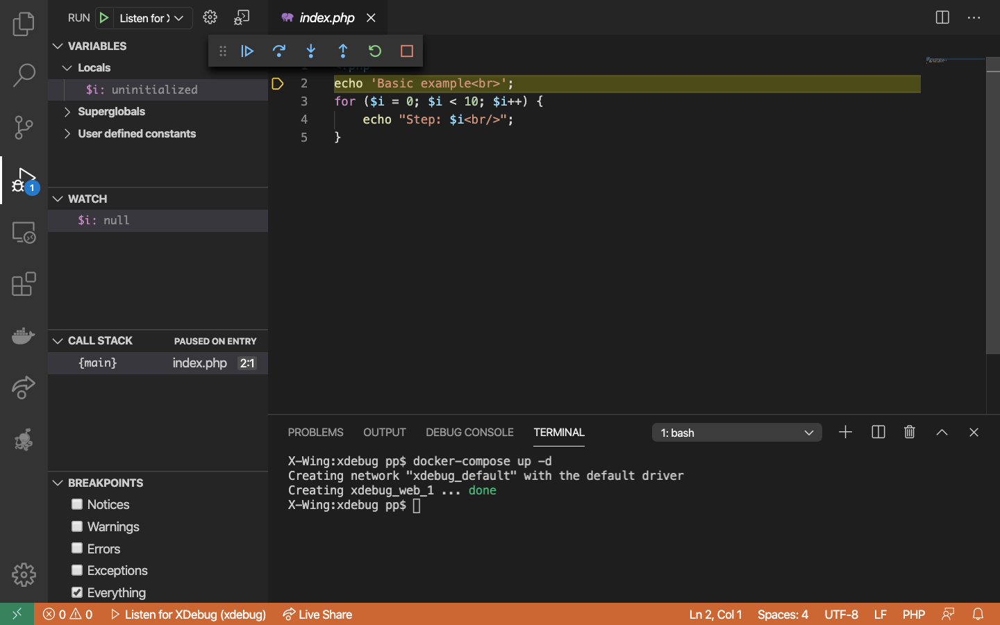

# Introduction

This is a tiny demo project for presenting how to debug your PHP code in VSCode with Docker and XDebug



# Quickstart

1. Install PHP Debug extension from Felix Becker (search: felixfbecker.php-debug)

2. Copy docker-compose.override.yml.dev to docker-compose.override.yml
```
cp docker-compose.override.yml.dev docker-compose.override.yml
```
Change what you need. For example: change host port, change XDebug settings etc.

3. Build and run your containers
```
docker-compose build
docker-compose up -d
```
4. Run "Listen for XDebug" task on debugger tab.

5. Load minimal application page in the browser or run minimal application in the cli with the following command:
```
docker-compose exec web php index.php
```

6. Debug
